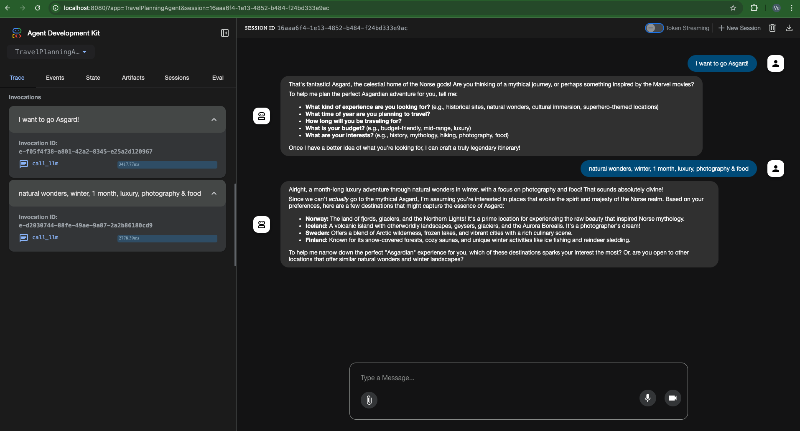

# Google ADK for Java: Getting Started

This project demonstrates how to build and run LLM agents using the Google ADK (Agent Development Kit) for Java.



## How to run

1. Clone this repository
2. Ensure Java 21+ is installed
3. Ensure Google API Key is available as an Environment Variable
   ```properties
   GOOGLE_API_KEY=your_key_here
   GOOGLE_GENAI_USE_VERTEXAI=false
   ```
4. Clean and build the project:
   ```bash
   ./gradlew clean build
   ```
5. Run the development server using the Gradle task:
   ```bash
   ./gradlew runAdkWebServer
   ```
6. Open your browser and navigate to `http://localhost:8080`
7. Test the AlarmAgent through the provided UI